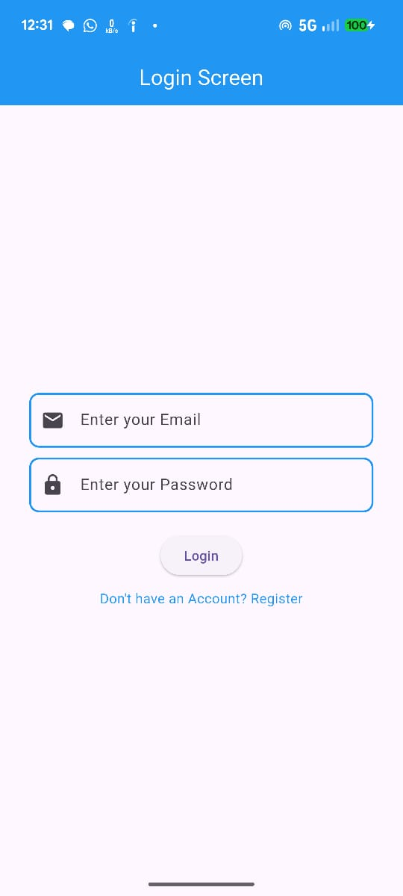
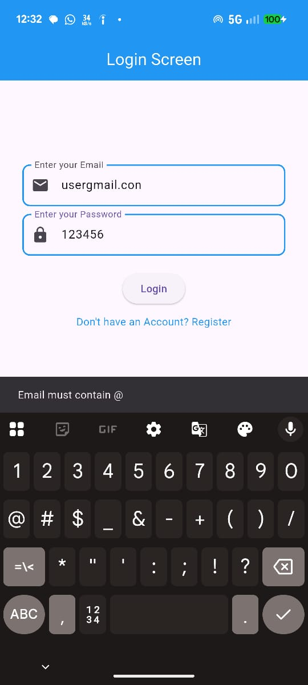
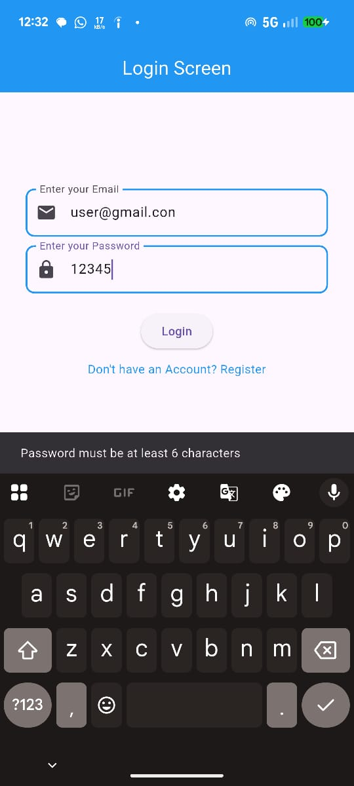
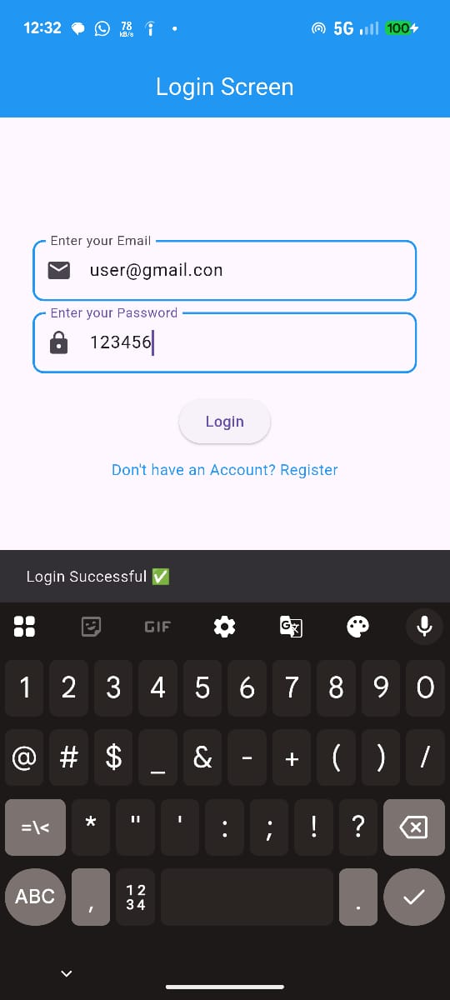

# Flutter Login UI

A simple **Flutter login screen** with validation.  
- Email must include `@`.  
- Password must be at least 6 characters.  
- Validation errors are shown using SnackBar.  

---

## 📁 Folder Structure

flutter-login-ui/
├─ lib/
│ ├─ logic/
│ │ └─ login_logic.dart
│ ├─ widget/
│ │ └─ text_field_widget.dart
│ └─ login_screen.dart
├─ images/
│ ├─ login_screen_1.png
│ └─ login_screen_2.png
├─ pubspec.yaml
└─ README.md
## 🖼 Screenshots






## ⚙️ Setup Instructions

1. **Clone the repository**

```bash
git clone < https://github.com/daspranay918/flutter-login-ui >


